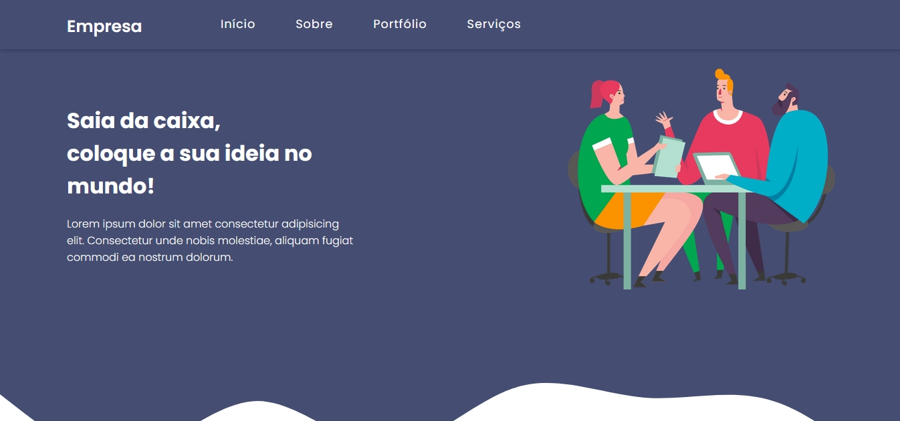

# 🛒 Plataforma empresa 

## 🖥 Visualização

## 🛠 Tecnologias utilizadas
Para o desenvolvimento deste site utilizei as seguintes tecnologias:
- Visual Studio Code;
- HTML;
- CSS;
- JQuery;
- JavaScript;

## 📌 Ajustes e melhorias
O site ainda está em desenvolvimento e as próximas atualizações serão voltadas nas seguintes tarefas:

(Próxima atualização: 15/11/2020)

- [x] Novo design;
- [ ] Ajustes no novo design;
- [ ] Responsividade;

---

## ⛩ Seja um dos contribuidores 
Quer fazer parte desse projeto? É simples! 
Faça um fork dele e coloque as suas modificações, depois mande um pull request. 

## 📝 Licença 
O uso não autorizado para comercialização deste material sem permissão expressa e por escrito. 

🏰 Orgulhosamente feito por <strong>Iuri Silva</strong>

